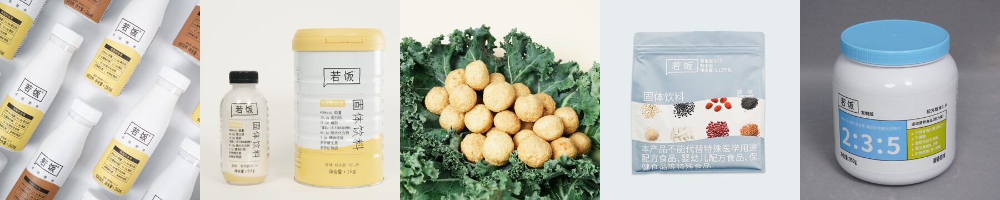
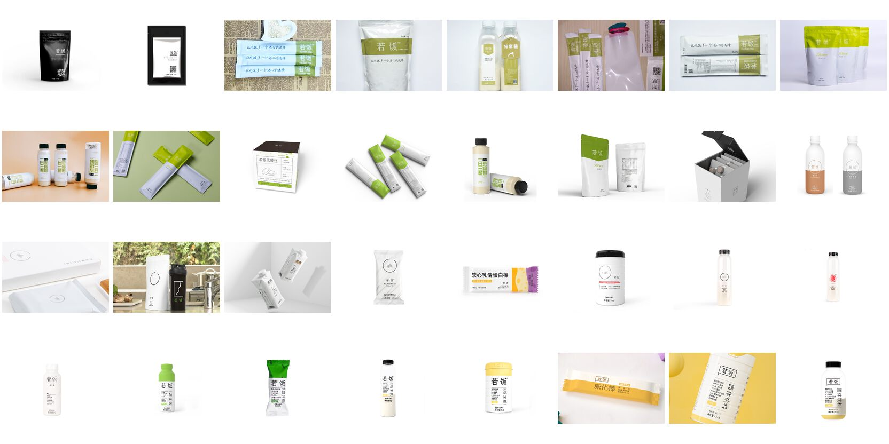

# 若饭

> 让吃饭多一个省心的选择。

若饭是一顿营养完整、可以持续替代正餐的饭。2015 年 5 月 29 日发布第一代产品，至今迭代了 30 多个版本，服务过 40 万以上的用户。

这个仓库记录若饭各产品线的配方、营养成分和版本历史。最新、最完整的信息以 [若饭官网](https://www.ruffood.com/) 为准。

*更新于 2026 年 9 月*

## 项目初心

起点很朴素：一群程序员发现外卖又贵又不健康，很多时候不知道吃什么，甚至懒得吃饭，工作忙的时候也不想因为肚子饿被迫停下来。

所以我们用技术思维切入营养科学，按照膳食指南的参数调配全营养餐，把营养配比精确到克。理论上可以持续代替一日三餐，作为人类新一代的主粮。

市面上多数代餐营养并不均衡：脂肪严重不足，热量太低，吃完没法工作。我们更多参照 Soylent 的思路去做，也请教过航天营养液的研发方，拿到了最原始的配料架构。

## 产品线

| 产品线 | 当前版本 | 形态 | 规格 | 热量 | 状态 |
|--------|---------|------|------|------|------|
| [液体版](liquid-V3/) | V3.9 | 即饮瓶装 | 260ml/瓶 | 260kcal/瓶 | 在售 |
| [粉末版](powder-V2/) | V2.15 | 冲调粉末 | 1000g/罐、93g/瓶 | 约 430kcal/100g，400kcal/瓶 | 在售 |
| [固体版](solid-V1/) | V1.15 | 纤蔬脆球 | 49g/袋 | 182kcal/袋 | 在售 |
| [青春版](youth/) | V0.3 | 粉末包 + 颗粒球 | 1120g、40g | 381kcal/100g（粉末包） | 在售 |
| [定制版](custom/) | 配方版本 1.0 | 冲调粉末 | 950g/罐 | 467kcal/100g | 在售 |
| [外挂版](attachment/) | - | 营养补充 | - | - | 研发中 |

### 主线产品对比

| 项目 | 固体版袋装 | 粉末版罐装 | 粉末版瓶装 | 液体版瓶装 |
|------|-----------|-----------|-----------|-----------|
| 首发时间 | 2015 年 5 月 | 2015 年 10 月 | 2016 年 5 月 | 2018 年 5 月 |
| 最新版本 | V1.15 | V2.15 | V2.15 | V3.9 |
| 净含量 | 49g | 1000g | 93g | 260ml |
| 每份热量 | 182kcal | 约 4300kcal/罐 | 400kcal | 260kcal |
| 食用效率 | 4.9 | 4.7 | 4.8 | 5.0 |
| 饱腹感 | 5.0 | 5.0 | 5.0 | 4.9 |
| 营养均衡 | 4.5 | 5.0 | 5.0 | 4.8 |
| 便携性 | 5.0 | 4.7 | 4.9 | 4.8 |

评分满分 5 分，仅用于产品之间的相互比较。

## 研发理念

若饭从五个环节把控一顿饭：

1. **配料**：优质原料溯源，全部配料公开
2. **工艺**：UHT 灭菌、喷雾干燥、非油炸膨化、微囊包埋等 10 项核心工艺
3. **配方**：以中国居民膳食营养素参考摄入量（DRIs）为基础设计，追求完整营养，而不只是填饱肚子
4. **检测**：从原料到成品，覆盖营养成分、农残、重金属等项目
5. **认证**：国家高新技术企业，获省级基金孵化支持

我们不追求某一项数据做到极端，而是给不同人群提供均衡的营养；配料、工艺、检测报告和资质认证全部公开。

## 大事记

- **2015**：5 月 29 日发布第一代若饭 V1.0（咀嚼片形态）；10 月粉末版立项
- **2016**：粉末版 V2.1 发布；6 月液体版立项，初衷是省掉冲泡和洗杯子
- **2017**：粉末版 V2.3、固体版 V1.1 发布
- **2018**：液体版 V3.1 正式发布（480ml/500kcal）；固体版改为块状饼干；粉末版 V2.5 加入牛奶蛋白
- **2019**：液体版 V3.5 改用利乐包装；粉末版 V2.9 推出 1kg 罐装和 89g 瓶装；天猫旗舰店开通
- **2020**：用户突破 10 万，获省级基金孵化支持；液体版 V3.7 发布，大幅降低含糖量
- **2021**：粉末版 V2.11 新增叶黄素、植物甾醇、DHA 和 EPA；固体版 V1.11 推出首个咸味版
- **2022**：粉末版 V2.13 发布，蛋白质提升到 27%；固体版 V1.13 咸酥蛋黄味威化棒发布
- **2023**：获评国家高新技术企业，用户达到 30 万；液体版 V3.9 发布
- **2024**：用户突破 40 万，青春版、定制版、外挂版产品线启动
- **2025**：固体版 V1.15 纤蔬脆球、粉末版 V2.15 发布
- **2026**：青春版 V0.3 发布，颗粒球新增火爆香辣味

### 历代产品

## 相关链接

- [若饭官网](https://www.ruffood.com/)
- [品牌故事](https://www.ruffood.com/about/story)：四分钟视频，讲若饭是怎么来的
- [常见问答](https://www.ruffood.com/health/faq)
- [食用量计算器](https://www.ruffood.com/tools/intake)：按身高、体重、活动量算出每餐建议克数
- [饱腹感计算器](https://www.ruffood.com/tools/satiety)：预测一餐能顶多久
- [天猫旗舰店](https://ruofansp.tmall.com/)
- 微信公众号「若饭」

## 关于

- **运营主体**：浙江若饭食品科技有限公司
- **母公司**：杭州悠购网络科技有限公司
- **成立时间**：2015 年
- **地址**：浙江省杭州市余杭区五常街道高教路 970 号 6 幢 7 楼
- **客服电话**：400-040-1022
- **邮箱**：hi@ruofan.me
- **创始人**：伯恩（微信 ruofan0529，加好友请注明「github」）

> 花名「伯恩」，物理系出身，自学编程，做过 Linux C 开发，参与过开源软件推进联盟；读了法学硕士；自学营养师后创办了若饭。团队现在有专业营养师和食品专家。
