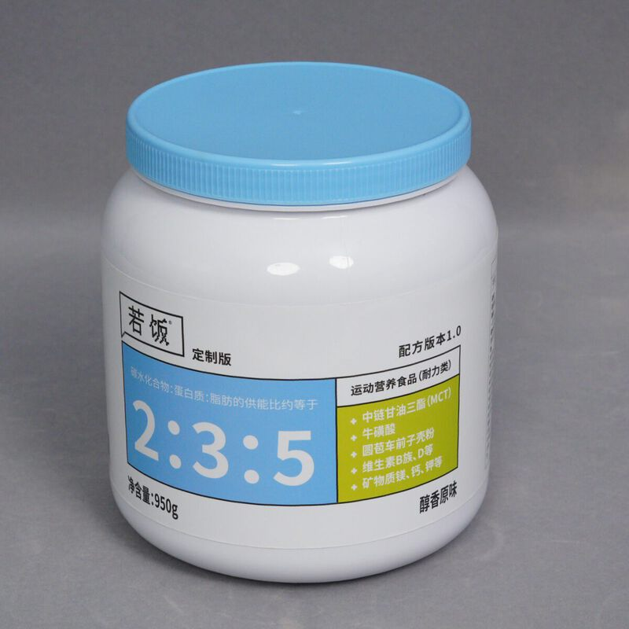
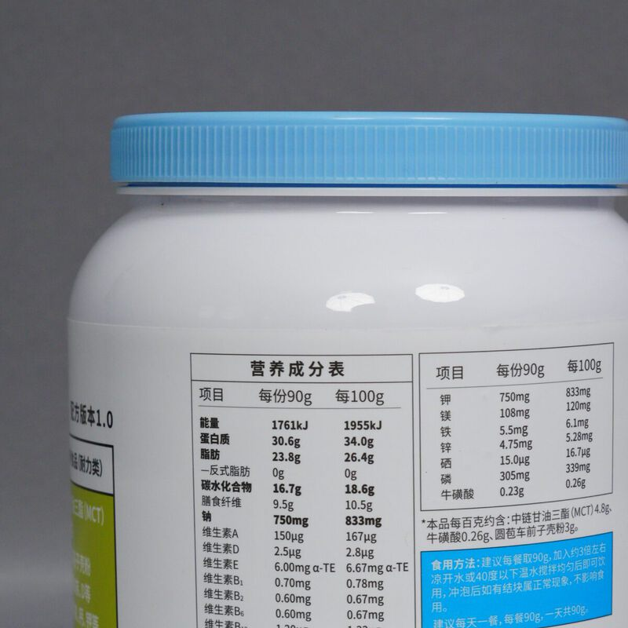
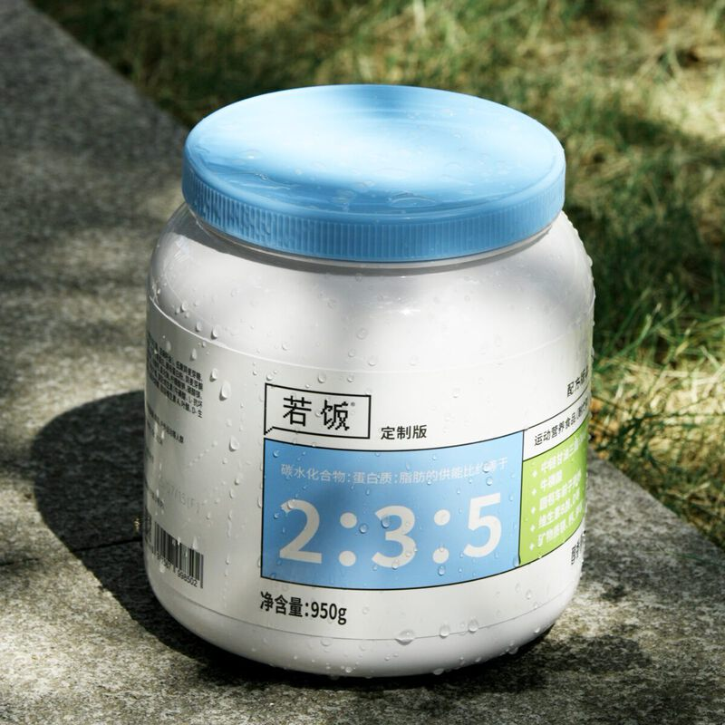

# 若饭定制版

> 按个人需求定制营养配方，由专业营养师给出食用方案。

**官网详情**：[ruffood.com/products/custom](https://www.ruffood.com/products/custom)

## 产品规格

| 参数 | 数值 |
|------|------|
| 类别 | 运动营养食品（耐力类） |
| 净含量 | 950g |
| 热量 | 1955kJ（约 467kcal）/100g |
| 蛋白质 | 34g/100g |
| 保质期 | 9 个月 |
| 储存 | 密封保存，置于阴凉干燥处，避免阳光直射 |

## 营养成分表（每 100g）

| 项目 | 含量 |
|------|------|
| 能量 | 1955 kJ |
| 蛋白质 | 34.0 g |
| 脂肪 | 26.4 g |
| 　反式脂肪 | 0 g |
| 碳水化合物 | 18.6 g |
| 膳食纤维 | 10.5 g |
| 钠 | 833 mg |
| 维生素 A | 167 µg RE |
| 维生素 D | 2.8 µg |
| 维生素 E | 6.67 mg α-TE |
| 维生素 B1 | 0.78 mg |
| 维生素 B2 | 0.67 mg |
| 维生素 B6 | 0.67 mg |
| 维生素 B12 | 1.33 µg |
| 维生素 C | 33.3 mg |
| 烟酸 | 7.78 mg |
| 叶酸 | 89 µg DFE |
| 生物素 | 16.7 µg |
| 泛酸 | 2.33 mg |
| 钙 | 333 mg |
| 钾 | 833 mg |
| 镁 | 120 mg |
| 铁 | 6.1 mg |
| 锌 | 5.28 mg |
| 硒 | 16.7 µg |
| 磷 | 339 mg |
| 牛磺酸 | 0.26 g |

以上为参考值，实际含量可能略有差异。

## 配料表

食用植物油微囊粉（含椰子油、中链甘油三酯、亚麻籽油）、大豆分离蛋白、酵母蛋白粉、异麦芽酮糖、酶解糙米粉、浓缩牛奶蛋白粉、全脂乳粉、复合矿物质、圆苞车前子壳粉、抗性糊精、燕麦纤维、复合维生素、未加碘食用盐。

**致敏原**：含大豆及其制品、乳及乳制品、燕麦及其制品。

冲泡后出现少量结块属于正常现象。开封后请妥善保存，尽快食用。

## 产品图

| | |
|:-:|:-:|
|  |  |

## 如何定制

通过 [官网联系页](https://www.ruffood.com/contact) 或客服电话 400-040-1022 联系我们，营养师会根据你的目标给出方案。
