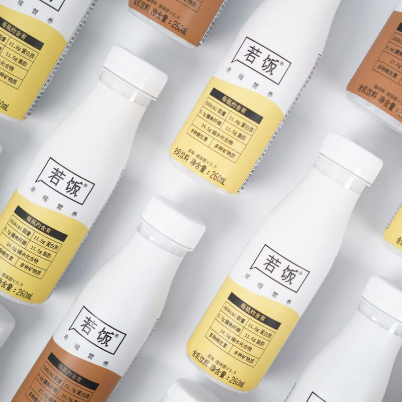
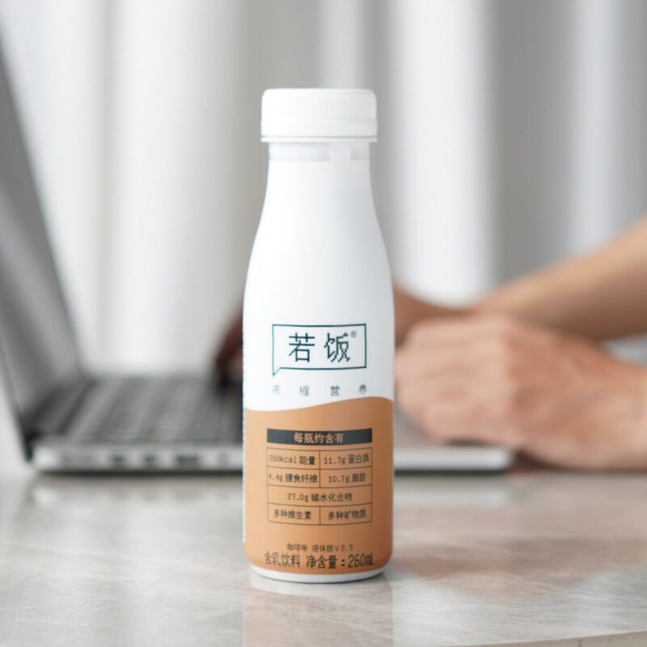
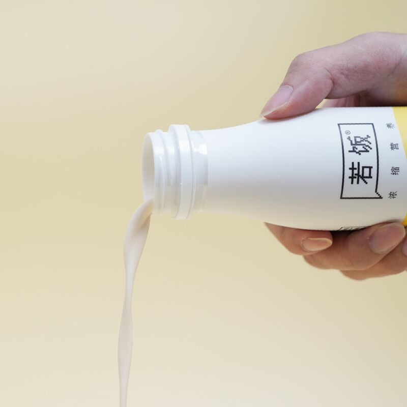
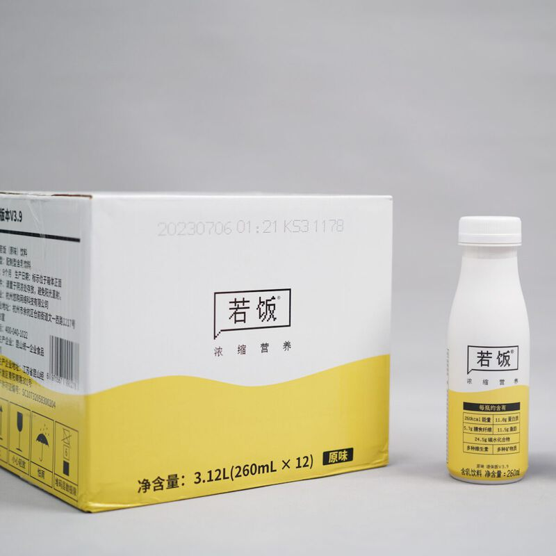

# 若饭液体版 V3.9

> 一分钟九分饱。主打早餐，轻负担、轻流程、轻营养，还做出了冰淇淋般的口感。

**发布时间**：2023 年 4 月
**官网详情**：[ruffood.com/products/liquid](https://www.ruffood.com/products/liquid)

## 产品规格

| 参数 | 数值 |
|------|------|
| 容量 | 260ml/瓶 |
| 热量 | 260kcal（1088kJ）/瓶 |
| 饱腹感 | 约 4 小时（因人而异，为估算值） |
| 工艺 | UHT 超高温瞬时灭菌 |
| 储存 | 常温保存，开盖即饮 |
| 口味 | 原味、咖啡味（每瓶含咖啡因约 90mg） |

## 研发逻辑

**理论依据**

1. 参照中美两国成年人每日膳食营养素参考摄入量（DRIs）设计营养数据，侧重早餐和加餐场景：每瓶 260kcal，饱腹感 4 小时左右。
2. 按现行普通食品法规确定营养强化指标。目前最接近若饭要求、并且有生产标准的是「含乳饮料 GB/T 21732」，我们在满足该标准乳制品含量的基础上，添加适量植物蛋白、不饱和脂肪、碳水以及维生素和矿物质。

**优化依据**

1. 根据《中国居民膳食指南（2016）》和《中国肥胖预防和控制蓝皮书》，国内日常糖摄入普遍超标，所以配方不用白砂糖，改用异麦芽酮糖等提供碳水和微量甜味。
2. 考虑到食用频率较高，不加色素、调味剂和防腐剂。为了口味，从 V3.9 开始添加了食用香精。

## 营养成分表

| 项目 | 原味 每瓶 260ml | NRV% | 咖啡味 每瓶 260ml | NRV% |
|------|---------------|------|-----------------|------|
| 能量 | 1088 kJ | 13% | 1089 kJ | 13% |
| 蛋白质 | 11.8 g | 20% | 11.7 g | 20% |
| 脂肪 | 11.5 g | 19% | 10.7 g | 18% |
| 　饱和脂肪 | 2.6 g | 13% | 2.4 g | 12% |
| 　反式脂肪 | 0 g | - | 0 g | - |
| 碳水化合物 | 24.5 g | 8% | 27.0 g | 9% |
| 　糖 | 2.5 g | - | 1.8 g | - |
| 膳食纤维 | 5.7 g | - | 4.4 g | - |
| 钠 | 136 mg | 7% | 166 mg | 8% |
| 维生素 A | 151 µg RE | 19% | 147 µg RE | 18% |
| 维生素 D | 3.0 µg | 60% | 3.9 µg | 78% |
| 维生素 E | 4.41 mg α-TE | 32% | 5.56 mg α-TE | 40% |
| 维生素 B1 | 0.29 mg | 21% | 0.25 mg | 18% |
| 维生素 B2 | 0.40 mg | 29% | 0.39 mg | 28% |
| 维生素 B6 | 0.46 mg | 33% | 0.49 mg | 35% |
| 维生素 B12 | 0.93 µg | 37% | 0.79 µg | 32% |
| 维生素 C | 15.8 mg | 16% | 15.8 mg | 16% |
| 烟酸 | 2.62 mg | 19% | 3.59 mg | 26% |
| 钙 | 219 mg | 27% | 190 mg | 24% |
| 磷 | 154 mg | 22% | 182 mg | 26% |
| 钾 | 64 mg | - | 70 mg | - |
| 铁 | 3.1 mg | 21% | 3.1 mg | 21% |
| 锌 | 2.53 mg | 17% | 2.49 mg | 17% |
| 硒 | 17.9 µg | 36% | 17.9 µg | 36% |

以上为参考值，实际含量可能略有差异。

## 配料表

**原味**：水、异麦芽酮糖、植物油、麦芽糊精、浓缩牛奶蛋白粉（添加量≥2.5%）、大豆分离蛋白、全脂乳粉、聚葡萄糖（膳食纤维）、燕麦纤维、微晶纤维素、磷脂、复合维生素（烟酸、维生素 E、维生素 B1、维生素 B2、维生素 B6、维生素 A、维生素 B12、维生素 D、维生素 C）、D-异抗坏血酸钠、卡拉胶、复合矿物质（焦磷酸铁、葡萄糖酸锌、亚硒酸钠）、碳酸氢钠、食用香精。

**咖啡味**：在原味配料基础上加入浓缩咖啡液。

## 产品图

| | | |
|:-:|:-:|:-:|
|  |  |  |

## 购买渠道

[天猫旗舰店](https://ruofansp.tmall.com/)

## 升级日志

- **V3.9**（2023.04）：历时两年，主打早餐需求，实现冰淇淋口感
- **V3.7 桑茶味**（2021.04）：第三个口味，额外强化骨骼和皮肤健康相关营养
- **V3.7 微调**（2020.11）：根据用户反馈优化配方和口感
- **V3.7**（2020.04）：营养快充瓶，350ml/350kcal，全面升级口感，大幅降低含糖量，侧重日常营养补充
- **V3.5**（2019.06）：改用利乐包装，推出原味和咖啡味，330ml/350kcal，侧重早餐和加餐
- **V3.3**（2018.10）：配方和口味优化
- **V3.1**（2018.05）：首个正式版本，480ml/500kcal，可搭配固体版作为正餐。能量密度和营养密度都很高，被生产工厂和部分食品企业称为「国内 RTD 产品里研发难度最高的一款」
- **立项**（2016.06）：粉末版要冲泡，喝完还得洗杯子，于是开始做开盖即饮的液体版
