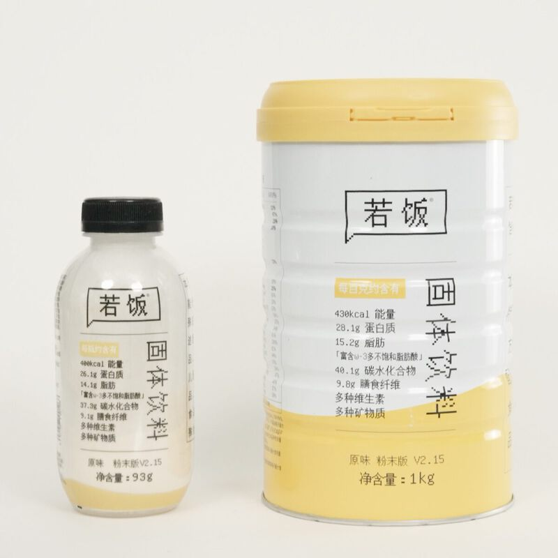
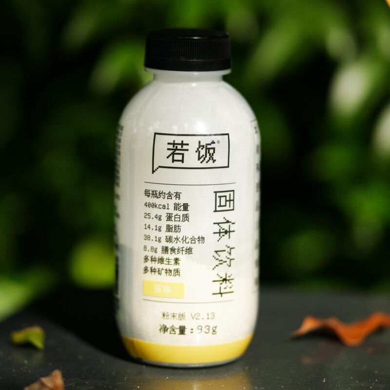
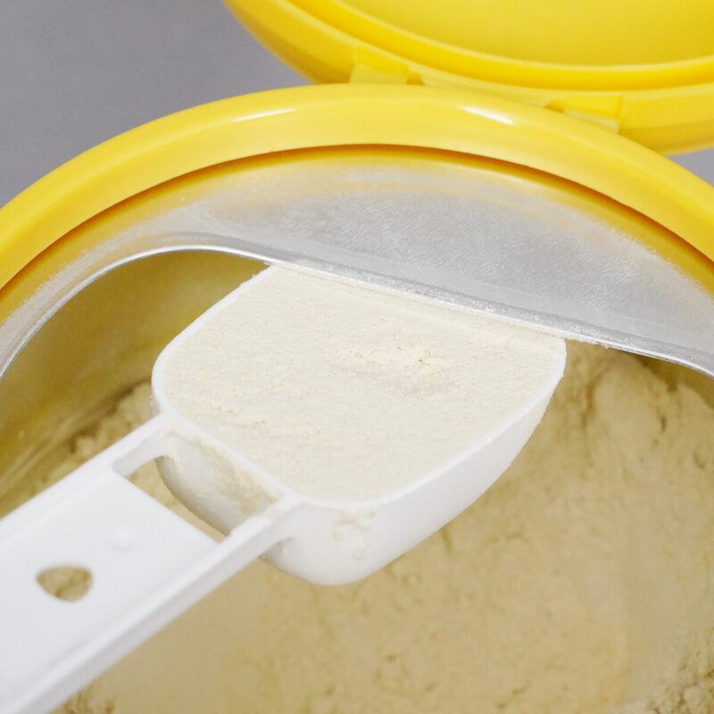
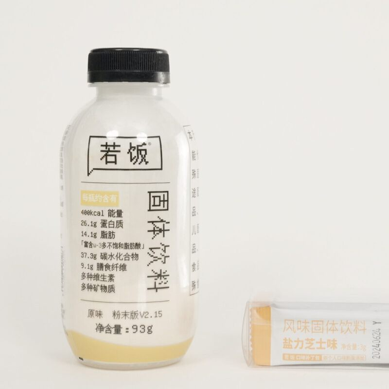

# 若饭粉末版 V2.15

> 28% 高蛋白，降脂肪，降碳水。罐装和瓶装两种选择，浓度可以自己调。

**发布时间**：2025 年 7 月
**官网详情**：[ruffood.com/products/powder](https://www.ruffood.com/products/powder)

## 产品规格

| 参数 | 罐装 | 瓶装 |
|------|------|------|
| 净含量 | 1000g/罐 | 93g/瓶 |
| 热量 | 1800kJ（约 430kcal）/100g | 1674kJ（400kcal）/瓶 |
| 蛋白质 | 28.1g/100g，符合高蛋白国标 | 26.1g/瓶 |
| 工艺 | 喷雾干燥 | 喷雾干燥 |

## 研发逻辑

**理论依据**

1. 参照中美两国成年人每日膳食营养素参考摄入量（DRIs）设计营养数据。
2. 按现行普通食品法规确定营养强化指标。目前最接近若饭要求、并且有生产标准的是「固体饮料 GB 29602」，我们在此基础上添加适量脂肪、碳水以及维生素和矿物质。

**优化依据**

1. 根据《中国居民膳食指南（2016）》和《中国肥胖预防和控制蓝皮书》，国内日常糖摄入普遍超标，所以配方不用白砂糖，改用异麦芽酮糖等提供碳水和微量甜味。
2. 多种营养素同时存在会影响彼此的吸收率，因此额外提高了水溶性 B 族维生素的含量。
3. 考虑到食用频率较高，不加香精、色素、调味剂和防腐剂。

## 营养成分表

| 项目 | 罐装 每 100g | NRV% | 瓶装 每瓶 93g | NRV% |
|------|------------|------|-------------|------|
| 能量 | 1800 kJ | - | 1674 kJ | - |
| 蛋白质 | 28.1 g | 47% | 26.1 g | 44% |
| 脂肪 | 15.2 g | 25% | 14.1 g | 23% |
| 　饱和脂肪 | 1.9 g | 10% | 1.8 g | 9% |
| 　反式脂肪 | 0 g | - | 0 g | - |
| 胆固醇 | 8 mg | - | 7 mg | - |
| 碳水化合物 | 40.1 g | 13% | 37.3 g | 12% |
| 　糖 | 6.9 g | - | 6.4 g | - |
| 膳食纤维 | 9.8 g | - | 9.1 g | - |
| 钠 | 496 mg | 25% | 461 mg | 23% |
| 维生素 A | 477 µg RE | 60% | 443 µg RE | 55% |
| 维生素 D | 2.0 µg | 40% | 1.9 µg | 38% |
| 维生素 E | 8.88 mg α-TE | 63% | 8.26 mg α-TE | 59% |
| 维生素 B1 | 0.95 mg | 68% | 0.88 mg | 63% |
| 维生素 B2 | 0.91 mg | 65% | 0.85 mg | 61% |
| 维生素 B6 | 0.76 mg | 54% | 0.71 mg | 51% |
| 维生素 B12 | 0.99 µg | 41% | 0.92 µg | 38% |
| 维生素 C | 100.0 mg | 100% | 93.0 mg | 93% |
| 烟酸 | 11.34 mg | 81% | 10.55 mg | 75% |
| 叶酸 | 177 µg DFE | 44% | 165 µg DFE | 41% |
| 泛酸 | 2.85 mg | 57% | 2.65 mg | 53% |
| 钙 | 464 mg | 58% | 432 mg | 54% |
| 磷 | 330 mg | 47% | 307 mg | 44% |
| 镁 | 139 mg | - | 129 mg | - |
| 铁 | 8.6 mg | 61% | 8.0 mg | 57% |
| 锌 | 6.43 mg | 43% | 5.98 mg | 40% |

以上为参考值，实际含量可能略有差异。

## 配料表

罐装与瓶装配方相同：

大豆分离蛋白、酶解燕麦粉、亚麻籽油微囊粉（食用油脂制品）、葵花籽油微囊粉（食用油脂制品）、麦芽糊精、浓缩牛奶蛋白粉、酵母蛋白粉、酶解糙米粉、异麦芽酮糖、浓缩乳清蛋白粉、复配矿物质（磷酸氢钙、碳酸钙、碳酸镁、焦磷酸铁、氧化锌）、大米蛋白粉、圆苞车前子壳粉、抗性糊精、燕麦纤维、南瓜原粉、菠菜粉、胡萝卜粉、磷脂、粉末植物甾醇酯（植物甾醇酯、低聚异麦芽糖、酪蛋白酸钠、单,双甘油脂肪酸酯）、DHA 藻油粉（DHA 藻油、乳糖、乳清蛋白粉、无水奶油、柠檬酸钠、抗坏血酸钠、磷脂、磷酸三钙、单,双甘油脂肪酸酯、抗坏血酸棕榈酸酯、维生素 E）、鱼油粉、复配维生素（L-抗坏血酸钠、烟酰胺、dl-α-醋酸生育酚、D-泛酸钙、盐酸硫胺素、核黄素、盐酸吡哆醇、醋酸维生素 A、叶酸、氰钴胺、维生素 D3）、叶黄素酯微囊粉（低聚麦芽糖、阿拉伯胶、中链甘油三酯、叶黄素酯、抗坏血酸钠）、未加碘食用盐。

**蛋白质来源**：大豆分离蛋白、浓缩牛奶蛋白、浓缩乳清蛋白、酵母蛋白、大米蛋白
**脂肪来源**：亚麻籽油、葵花籽油、鱼油、DHA 藻油
**额外添加**：叶黄素、植物甾醇、EPA/DHA、南瓜、菠菜、胡萝卜

## 产品图

| | | |
|:-:|:-:|:-:|
|  |  |  |

## 购买渠道

[天猫旗舰店](https://ruofansp.tmall.com/)

## 升级日志

- **V2.15**（2025.07）：新增酵母蛋白，加强 EPA 和 DHA，新增胡萝卜粉，优化快碳和慢碳的比例
- **V2.13 罐装**（2022.09）：同款配方推出罐装，罐型优化，存储和取用更方便
- **V2.13 瓶装**（2022.08）：瓶型升级，27% 高蛋白，降脂肪，降碳水
- **V2.11 罐装**（2021.03）：V2.11 配方推出罐装
- **V2.11**（2021.01）：新增叶黄素、植物甾醇、DHA 和 EPA，在均衡营养之外更关注视力、智力和活力
- **V2.9**（2019.10）：推出 1kg 罐装和 89g 瓶装
- **V2.7**（2018.10）：降低甜度，用香草粉遮盖豆腥味
- **V2.5**（2018.05）：新增牛奶蛋白，形成三种蛋白组合
- **V2.3**（2017.04）：配方和口味优化
- **V2.1**（2016.03）：配方优化
- **立项**（2015.10）：粉末版项目启动
