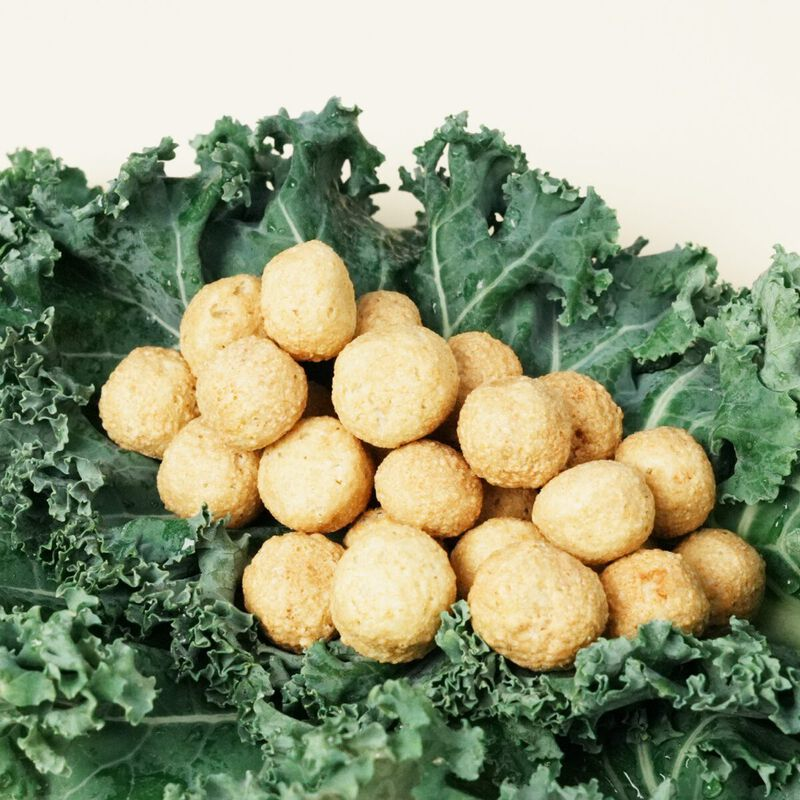
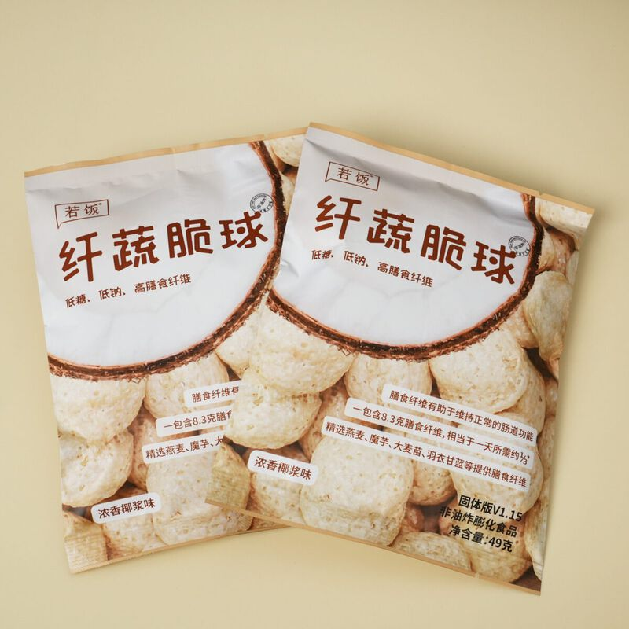
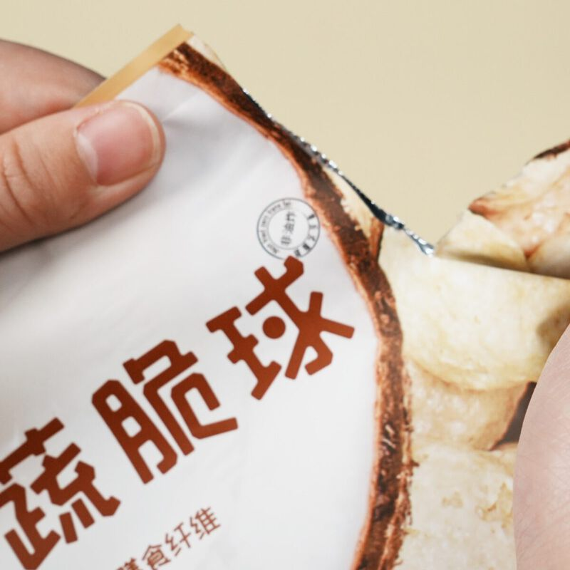
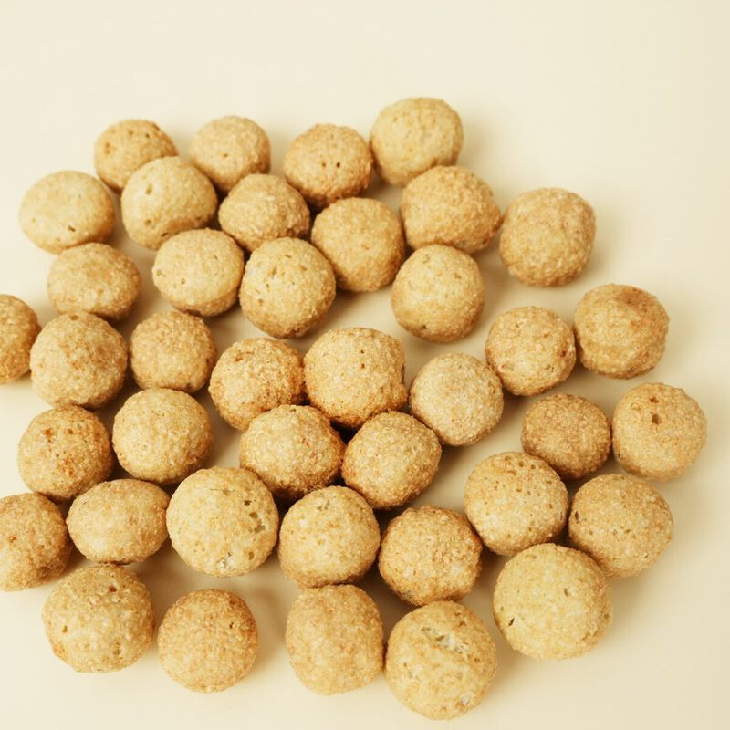

# 若饭固体版 V1.15 纤蔬脆球

> 非油炸膨化，低钠低糖，侧重补充膳食纤维。好吃，也抗饿。

**发布时间**：2025 年 3 月
**官网详情**：[ruffood.com/products/solid](https://www.ruffood.com/products/solid)

## 产品规格

| 参数 | 数值 |
|------|------|
| 净含量 | 49g/袋 |
| 热量 | 182kcal（764kJ）/袋 |
| 膳食纤维 | 8.3g/袋，约为一天所需的三分之一 |
| 形态 | 球状，非油炸膨化 |

适合放在办公室或随身携带，当加餐吃，也是液体版的好搭档。

## 研发逻辑

**理论依据**

1. 参照中美两国成年人每日膳食营养素参考摄入量（DRIs）设计营养数据，以一天 2000kcal 为基准。
2. 按现行普通食品法规确定营养强化指标。目前最接近若饭要求、并且有生产标准的是「饼干 GB/T 20980」，我们在此基础上重新设计了脂肪、碳水、膳食纤维、蛋白质以及维生素和矿物质的含量。

**优化依据**

1. 根据《中国居民膳食指南（2016）》和《中国肥胖预防和控制蓝皮书》，国内日常糖摄入普遍超标，所以配方不用白砂糖。
2. 考虑到食用频率较高，不加色素和防腐剂。

## 营养成分表（每袋 49g）

| 项目 | 含量 |
|------|------|
| 能量 | 764 kJ |
| 蛋白质 | 5.6 g |
| 脂肪 | 3.5 g |
| 　反式脂肪 | 0 g |
| 碳水化合物 | 27.8 g |
| 　糖 | 1.5 g |
| 膳食纤维 | 8.3 g |
| 钠 | 22 mg |

以上为参考值，实际含量可能略有差异。

## 配料表

粳米粉、低聚异麦芽糖液、聚葡萄糖、燕麦粉（≥11%）、椰子油、浓缩牛奶蛋白粉、大豆蛋白粉、椰浆粉、魔芋粉（≥1.2%）、脱水大麦苗粉（≥1.2%）、脱水羽衣甘蓝粉（≥0.6%）、碳酸钙、食用香精。

## 产品图

| | | |
|:-:|:-:|:-:|
|  |  |  |

## 购买渠道

[天猫旗舰店](https://ruofansp.tmall.com/)

## 升级日志

- **V1.15**（2025.03）：纤蔬脆球，非油炸膨化，低钠低糖，侧重补充膳食纤维
- **V1.13**（2022.06）：咸酥蛋黄味威化棒，高蛋白、高纤维、低糖，作为长期支持版本持续优化
- **V1.11**（2021.05）：首个咸味固体版，香烤海苔味，低糖、高蛋白、高纤维
- **V1.9**（2020.07）：软心乳清蛋白棒，甜品级口感
- **V1.7**（2019.12）：若饭焙烤糕点
- **V1.5**（2018.05）：改为块状饼干
- **V1.3**（2018.01）：配方和形态优化
- **V1.1**（2017.12）：配方优化
- **V1.0**（2015.05）：第一代若饭产品，咀嚼片形态

> 固体版最早叫 tablet，是装在塑料板里的药片形状。后来变成了饼干、蛋白棒，现在是球状膨化食品，叫 solid 更贴切。
