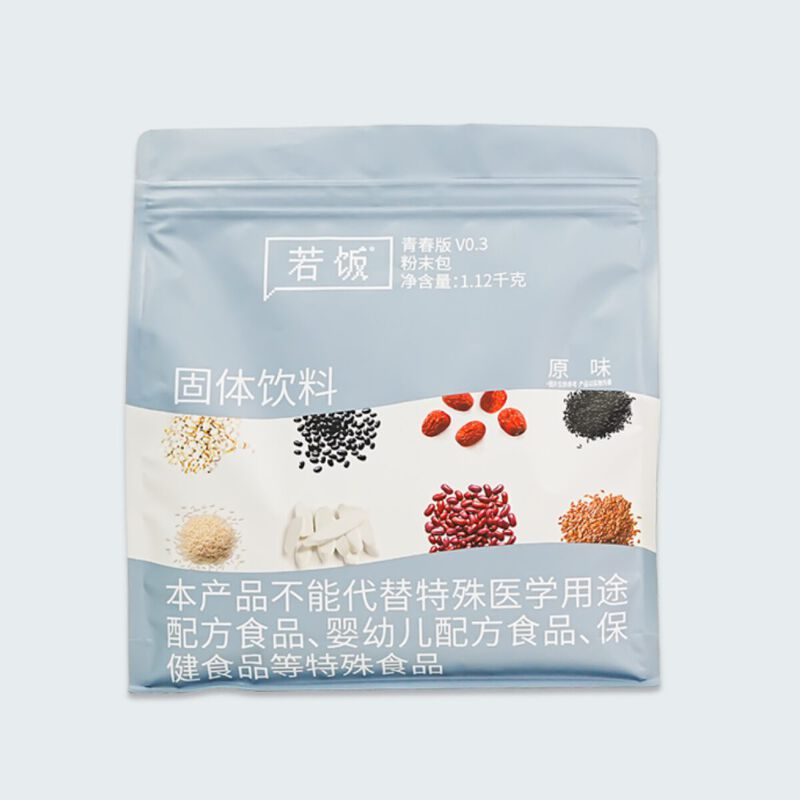
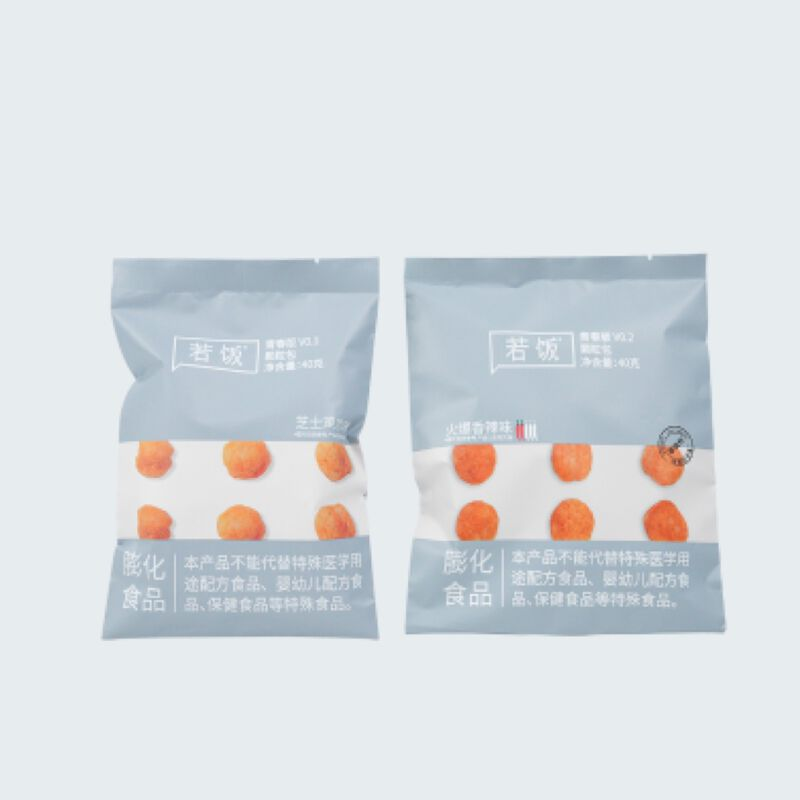
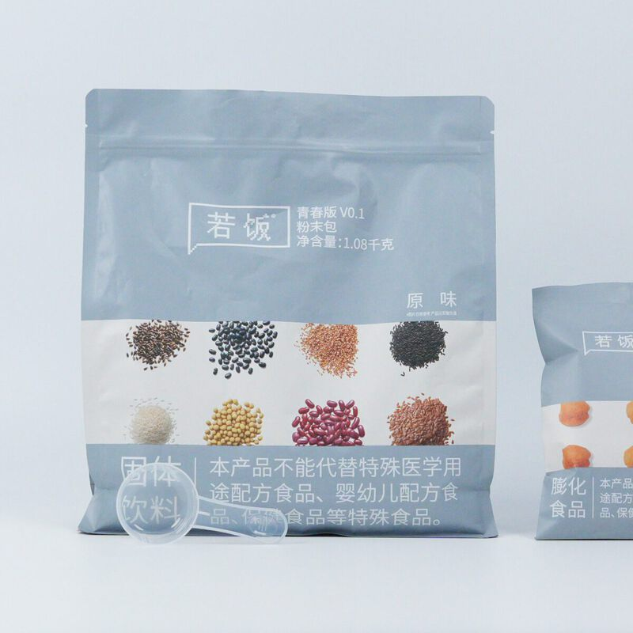

# 若饭青春版 V0.3

> 专为年轻人设计。经常点外卖、三餐不规律、食堂吃腻、懒得做饭，用一顿若饭补上身体真正需要的营养。

**发布时间**：2026 年 7 月
**官网详情**：[ruffood.com/products/youth](https://www.ruffood.com/products/youth)

## 产品规格

| 类型 | 净含量 | 说明 |
|------|--------|------|
| 粉末包 | 1120g | 冲调食用，381kcal/100g |
| 颗粒球 | 40g | 即开即食的咸口零食，芝士鸡肉、火爆香辣两种口味 |

保质期 8 个月，置于阴凉干燥处，避免阳光直射。

## 研发逻辑

**理论依据**

1. 参照中国居民膳食营养素参考摄入量（DRIs），设计蛋白质、脂肪、碳水化合物的供能比例以及维生素和矿物质的配比。
2. 以大米粉、全脂奶粉、大豆分离蛋白为营养基底，搭配红豆、红枣、薏米、山药、黑米、黑豆等杂粮，再用复配维生素和矿物质补齐日常饮食里容易缺的微量营养素。

**优化依据**

1. 针对外卖多、三餐不规律的饮食结构，强化蛋白质和膳食纤维，补充外卖里容易不足的维生素和矿物质。
2. 控制糖含量，粉末包每 100g 只有 5.2g 糖，天天吃也没负担。
3. 颗粒球做成咸口零食，解馋的同时也补一次营养。

## 营养成分表（每 100g）

### 粉末包

| 项目 | 含量 |
|------|------|
| 能量 | 1596 kJ |
| 蛋白质 | 23 g |
| 脂肪 | 9.5 g |
| 　反式脂肪 | 0 g |
| 碳水化合物 | 45.5 g |
| 　糖 | 5.2 g |
| 膳食纤维 | 10 g |
| 钠 | 342 mg |
| 维生素 A | 604 µg RE |
| 维生素 D | 1.6 µg |
| 维生素 E | 10.42 mg α-TE |
| 维生素 B1 | 0.90 mg |
| 维生素 B2 | 0.90 mg |
| 维生素 B6 | 1.30 mg |
| 维生素 B12 | 2.36 µg |
| 维生素 C | 120.0 mg |
| 烟酸 | 16.46 mg |
| 叶酸 | 254 µg DFE |
| 钙 | 360 mg |
| 磷 | 196 mg |
| 镁 | 174 mg |
| 铁 | 12.0 mg |
| 锌 | 8.39 mg |

### 颗粒球

| 项目 | 芝士鸡肉味 | 火爆香辣味 |
|------|-----------|-----------|
| 能量 | 1813 kJ | 1776 kJ |
| 蛋白质 | 21.9 g | 20.1 g |
| 脂肪 | 13.2 g | 12.9 g |
| 　反式脂肪 | 0 g | 0 g |
| 碳水化合物 | 52.6 g | 53.1 g |
| 　糖 | 3.7 g | 4.6 g |
| 膳食纤维 | 7.2 g | 6.8 g |
| 钠 | 749 mg | 758 mg |

以上为参考值，实际含量可能略有差异。

## 配料表

**粉末包**：大米粉、全脂奶粉、大豆分离蛋白、聚葡萄糖、红豆粉、红枣粉、薏米粉、山药粉、黑米粉、黑豆粉、复配矿物质（碳酸钙、碳酸镁、焦磷酸铁、乳酸锌）、亚麻籽油微囊粉（亚麻籽油、低聚麦芽糖）、复配维生素（维生素 C、维生素 E、烟酸、维生素 B2、维生素 A、叶酸、维生素 B6、维生素 B1、维生素 D、维生素 B12）、磷酸三钙。
致敏原：含大豆制品、乳制品。

**颗粒球 芝士鸡肉味**：大米粉、大豆分离蛋白、食用植物油、聚葡萄糖（膳食纤维）、芝士烤鸡肉串味调味料、燕麦粉、黑豆粉、黑芝麻粉。

**颗粒球 火爆香辣味**：大米粉、大豆分离蛋白、食用植物油、聚葡萄糖（膳食纤维）、香辣味调味料、燕麦粉、黑豆粉、黑芝麻粉。

颗粒球致敏原：含大豆及其制品、含麸质的谷物及其制品。

## 产品图

| | |
|:-:|:-:|
|  |  |

## 升级日志

- **V0.3**（2026.07）：粉末包净含量增加到 1120g，降低含糖量、提高膳食纤维；颗粒球新增火爆香辣味
